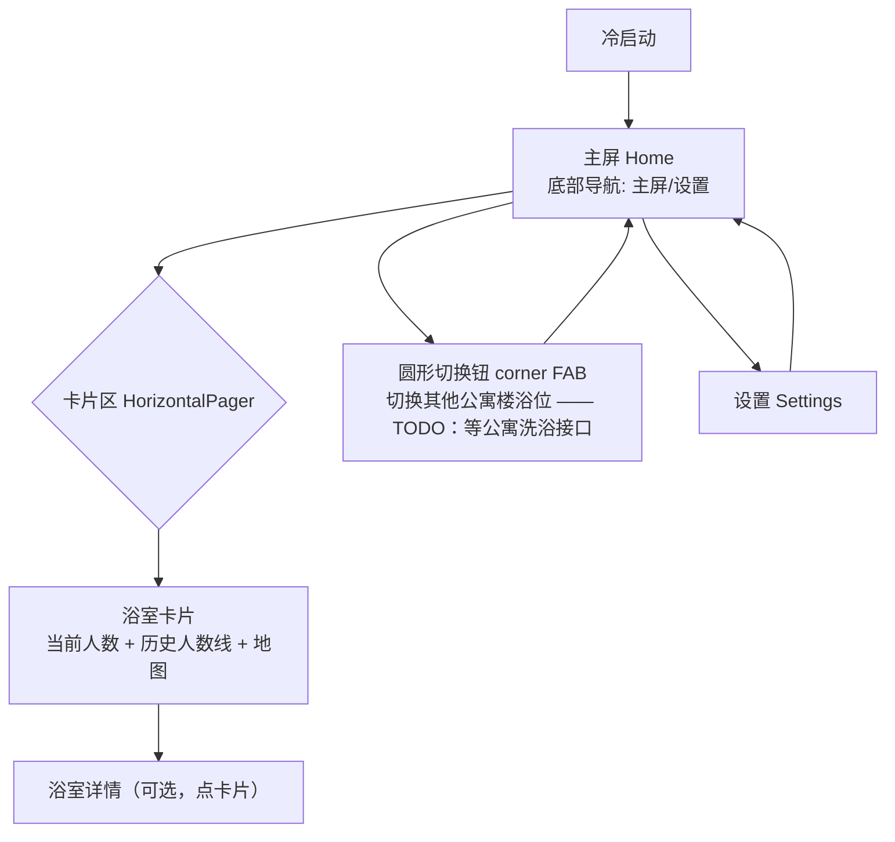

# Showerly 导航设计

> 三件套：导航图 + 屏幕清单 + 导航规则。决策原则：**无启动页、冷启动直达主屏、Material 3、极速轻量**。

## 0. 设计原则
- **无 Splash**：冷启动直接进主屏，数据异步加载（先骨架屏/占位，不阻塞首帧）。
- **单 Activity + Navigation Compose**，全 App 仅 2 个顶层目的地（主屏 / 设置）。
- **极速**：主屏数据极小（当前校区+性别仅 1~3 条），首屏只请求所需；地图/图表按需懒加载。
- 视觉统一走 **Material 3**（`MaterialTheme` + 动态取色/自定义主题色 + 深色模式）。

## 1. 导航图（Mermaid）

## 2. 屏幕清单

### 主屏 `home`
- 结构：顶部标题栏 + 卡片区（`HorizontalPager`）+ **右下角圆形切换钮**（corner FAB）。
- 卡片内容（每个浴室一张）：
  - 浴室名称 + 性别徽标
  - **当前人数**（大号）
  - **历史人数线**（迷你折线/Sparkline）
  - **地图**（浴室位置；依赖坐标，见“待办”）
  - 状态：空/正常/繁忙/爆满 + 颜色
- 圆形切换钮：打开后切换查看**其它公寓楼的浴位**；当前数据源未抓到 → **TODO**。
- 入口：冷启动直达。退出：到设置（底部导航）。
- 交互：左右滑切卡片、下拉刷新；点卡片 → 详情（可选，亦可卡片即详情）。

### 设置 `settings`
- 底部导航第二项。
- 内容：
  - **性别**（男/女）
  - **校区**（默认校区；校区可自定义命名）
  - **主题色**（Material 3 取色）
  - **深色模式**（跟随系统 / 浅色 / 深色）
  - 底部**个人信息**（署名 + GitHub 链接等）
- 保存即时生效并回主屏刷新；性别/校区改动只刷新主屏，不改接口鉴权（无需鉴权）。

## 3. 导航规则
- 顶部结构：`Scaffold` + `NavigationBar`（主屏/设置两项）+ `NavHost`（`home` / `settings`）。
- `home` 是唯一数据目的地：内部用 `HorizontalPager` 承载多张浴室卡片，不嵌套 NavGraph。
- 卡片区可点进 `detail/{id}`（如果做详情页）；默认卡片本身就是高清信息页。
- 圆形切换钮：若做全屏切换器，则作为 `dialog`/全屏 destination 或直接改 `HorizontalPager` 的数据源；**待公寓接口**。
- 主题色 / 深色模式：通过 `SettingsRepository` 持久化，`App` 层持有 `ThemeState` 包裹 `MaterialTheme`，改动即时重组全 App。
- 返回栈：主屏不重复入栈；设置返回主屏。

## 4. 待办（影响卡片内容）
- **历史人数线**：当前 `/bathroom` 只给实时值。要做折线，需后端（Phase 1 Workers+D1 轮询）积累历史，或校方另有历史接口 → 抓包确认。V1.0 未接后端时可先显示“暂无历史”。
- **地图**：校方接口无经纬度，需人工给每个浴室 id 配坐标；免费方案建议 **osmdroid + OpenStreetMap**（无 key、开源），但会增大包体积与瓦片流量。若只要示意，可先做“位置示意图”占位。
- **公寓洗浴**：圆形切换钮的数据源，待今晚抓包 `cloudman.jinghaojian.net` 的“公寓洗浴”接口后接入。

## 5. 主题
- Material 3 动态取色（Android 12+），并支持用户自选主题色 + 深浅模式；默认跟随系统。
